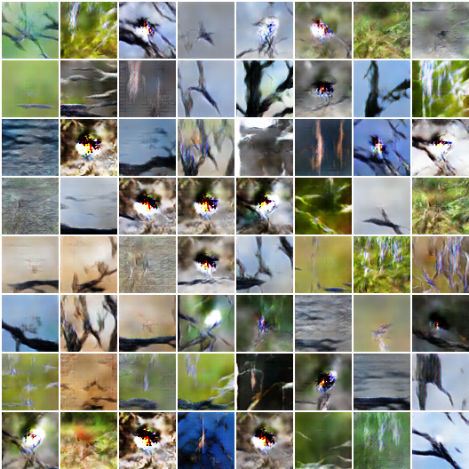
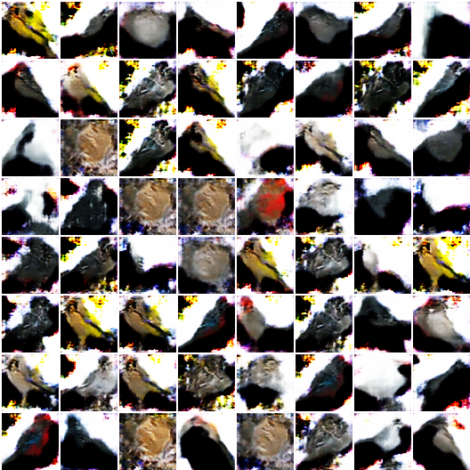

## Pytorch code for Layered Recursive Generative Adversarial Networks

### Introduction

This is the pytorch implementation of our ICLR 2017 paper ["LR-GAN: Layered Recursive Generative Adversarial Networks for Image Generation"](https://arxiv.org/pdf/1703.01560.pdf).

In our paper, we proposed LR-GAN to generate images layer-by-layer recursively considering images naturally have structure and context. As show below, LR-GAN first generates a background image, and then generates foregrounds with appearance, pose and shape. Afterward, LR-GAN place the foregrounds at somewhere of background accordingly.

<div style="color:#0000FF" align="center">

</div>

By this way, LR-GAN can significantly reduce the blending between background and foregrounds. Both the qualitative and quantitative comparisons indicate that LR-GAN could generate better and sharp images than the baseline DCGAN model.

### Disclaimer

This is the reproduction code of LR-GAN based on Pytorch. Our original code was implemented based on Torch during the first author's internship. All the results presented in our paper were obtained based on the Torch code, which cannot be released since the firm restriction. This project is an attempt to reproduce the results in our paper.

### Citation

If you find this code useful, please cite the following paper:

    @article{yang2017lr,
        title={LR-GAN: Layered recursive generative adversarial networks for image generation},
        author={Yang, Jianwei and Kannan, Anitha and Batra, Dhruv and Parikh, Devi},
        journal={ICLR},
        year={2017}
    }

### Dependencies

1. PyTorch. Install [PyTorch](http://pytorch.org/) with proper commands. Make sure you also install *torchvision*.

2. Spatial transformer network with mask (STNM). We have provided this module in this project. But if you want to do some your own changes, please refer to this [project](https://github.com/jwyang/stnm.pytorch).

### Train LR-GAN

Pull this project to your own machine, and then make sure Pytorch is installed successfully. Create a folder *datasets* to hold the training sets. Then, you can try to train the LR-GAN model on the following datasets:

1. CIFAR-10. CIFAR-10 is a 32x32 image dataset. We use two timesteps for the generation. The command for training is:
```bash
$ python train.py --dataset cifar10 --dataroot datasets/cifar-10 --ntimestep 2 --imageSize 32 --maxobjscale 1.2 --niter 100 --session 1
```
Here, *ntimestep* specifies the number of recursive timesteps; *imageSize* is the scale size the training images; *maxobjscale* is the maximal object (foreground) scale, the larger the value, the smaller the object size; *session* specifies the training session. Here are some randomly sampled generation results:

2. CUB200. We run on CUB200 in 64x64. Here is the processed dataset. Download it and unzip it into datasets/cub200. Then, run the following command:
```bash
$ python train.py --dataset cub200 --dataroot datasets/cub200 --ntimestep 2 --imageSize 64 --maxobjscale 1.2 --niter 200 --session 1
```

We first tried smaller generator and discriminator whose *ngf* and *ndf* are both 64. To keep consistent to our paper, we train the model for 200 epochs. Below are some randomly (without any cherry-picky) generated samples from the model trained for 200 epochs.

<div style="color:#0000FF" align="center">
   
</div>

Then, we increased *ngf* and *ndf* to 128 as in our paper. In both our Torch version code and this Pytorch version code, we found the training diverged, and **initializing BN layer with zero mean (default is 1.0) addressed this issue**. The training command is:
```bash
$ python train.py --dataset cub200 --dataroot datasets/cub200 --ntimestep 2 --imageSize 64 --maxobjscale 1.2 --ngf 128 --ndf 128 --niter 200 --session 1
```

The randomly generated samples are as follow:

<div style="color:#0000FF" align="center">
   
</div>
