## Pytorch code for Layered Recursive Generative Adversarial Networks

### Introduction

This is the pytorch implementation of our ICLR 2017 paper ["LR-GAN: Layered Recursive Generative Adversarial Networks for Image Generation"](https://arxiv.org/pdf/1703.01560.pdf).

In our paper, we proposed LR-GAN to generate images layer-by-layer recursively considering images naturally have structure and context. As show below, LR-GAN first generates a background image, and then generates foregrounds with appearance, pose and shape. Afterward, LR-GAN place the foregrounds at somewhere of background accordingly.

<div style="color:#0000FF" align="center">
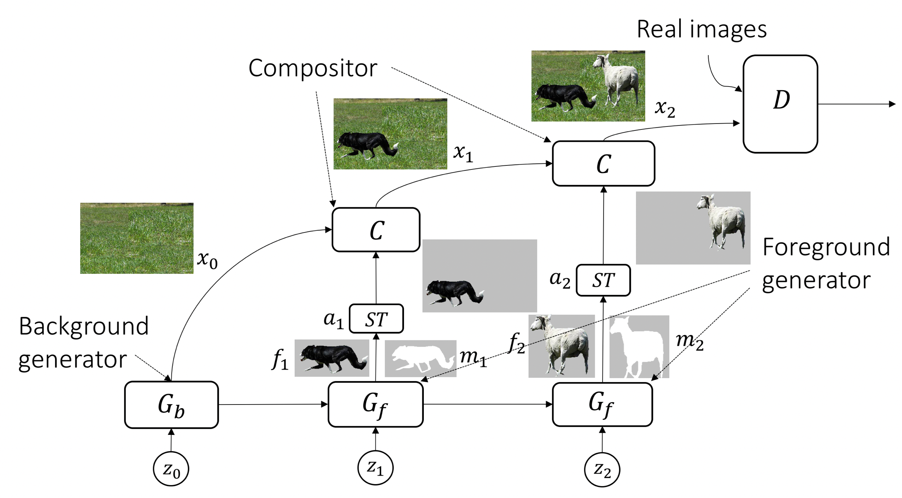
</div>

By this way, LR-GAN can significantly reduce the blending between background and foregrounds. Both the qualitative and quantitative comparisons indicate that LR-GAN could generate better and sharp images than the baseline DCGAN model.

### Disclaimer

This is the reimplementation code of LR-GAN based on Pytorch. It is developed based on [Pytorch DCGAN](https://github.com/pytorch/examples/tree/master/dcgan). Our original code was implemented based on Torch during the first author's internship. All the results presented in our paper were obtained based on the Torch code, which cannot be released since the firm restriction. This project is an attempt to reproduce the results in our paper.

### Citation

If you find this code useful, please cite the following paper:

    @article{yang2017lr,
        title={LR-GAN: Layered recursive generative adversarial networks for image generation},
        author={Yang, Jianwei and Kannan, Anitha and Batra, Dhruv and Parikh, Devi},
        journal={ICLR},
        year={2017}
    }

### Dependencies

1. PyTorch. Install [PyTorch](http://pytorch.org/) with proper commands. Make sure you also install *torchvision*.

2. Spatial transformer network with mask (STNM). Install STNM from this [project](https://github.com/jwyang/stnm.pytorch). **Since we might use different gpu devices and cuda driver, etc. Please make your own stnm.so on your machine.**

### Train LR-GAN

#### Preparation

Pull this project to your own machine, and then make sure Pytorch is installed successfully. Create a folder *datasets* to hold the training sets, and a folder *images* to save the generation results, and a folder *models* to save the models (generators and discriminators):

```bash
$ mkdir datasets
$ mkdir images
$ mkdir models
```

Then, you can try to train the LR-GAN model on the datasets: 1) MNIST-ONE; 2) MNIST-TWO; 3) CUB-200; 4) CIFAR-10. The sample images are shown below:

<div style="color:#0000FF" align="center">
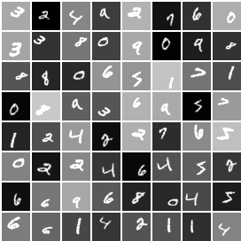 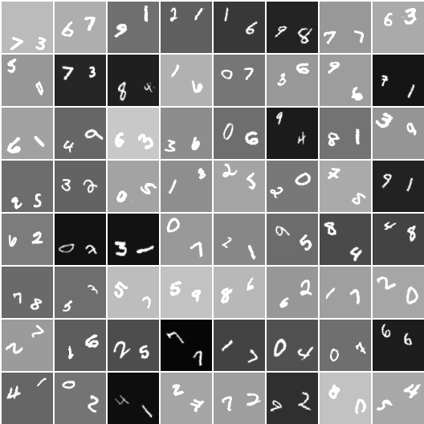  
</div>

In the *datasets* folder, create subfolders for all these datasets separately:

```bash
$ mkdir datasets/mnist-one
$ mkdir datasets/mnist-two
$ mkdir datasets/cub200
$ mkdir datasets/cifar10
```

#### Training

1. **MNIST-ONE**. We first run experiments on MNIST-ONE, which can be downloaded from [here](https://filebox.ece.vt.edu/~jw2yang/datasets/mnist-one.tgz). Unzip this into datasets/mnist-one folder, and then run the following command:
```bash
$ python train.py \
      --dataset mnist-one \
      --dataroot datasets/mnist-one \
      --ntimestep 2 \
      --imageSize 32 \
      --maxobjscale 1.2 \
      --niter 50 \
      --session 1
```
Here, *ntimestep* specifies the number of recursive layers, e.g., 2 means one background and one foreground layer; *imageSize* is the scale size the training images; *maxobjscale* is the maximal object (foreground) scale, the larger the value, the smaller the object size; *session* specifies the training session; *niter* specifies the number of training epochs. Below are randomly generation results using trained model in epoch 50:

<div style="color:#0000FF" align="center">
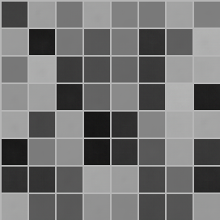 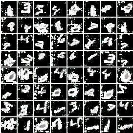 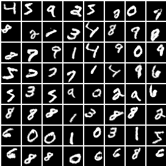 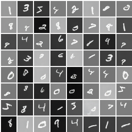
</div>

From left to right, they are generated background images, foreground images, foreground masks and final images.

2. **CUB200**. We run on CUB200 in 64x64. Here is the processed [dataset](https://filebox.ece.vt.edu/~jw2yang/datasets/cub200.tgz). Similarly, download it and unzip it into datasets/cub200. Then, run the following command:
```bash
$ python train.py \
      --dataset cub200 \
      --dataroot datasets/cub200 \
      --ntimestep 2 \
      --imageSize 64 \
      --ndf 128 \
      --ngf 128 \
      --maxobjscale 1.2 \
      --niter 200 \
      --session 1
```

Based on above command, we obtained the model same to the one in our paper. Below are randomly generated images:

<div style="color:#0000FF" align="center">
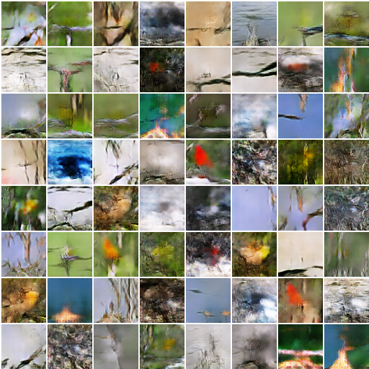 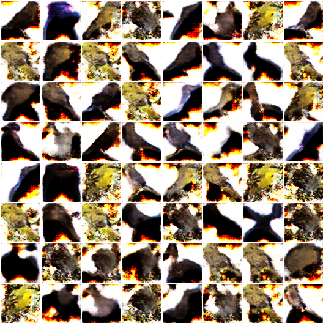 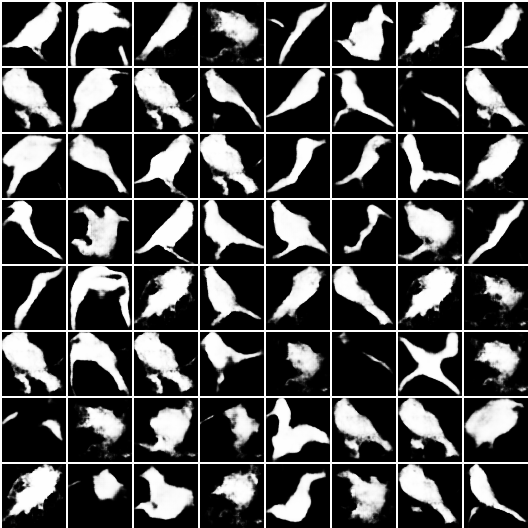 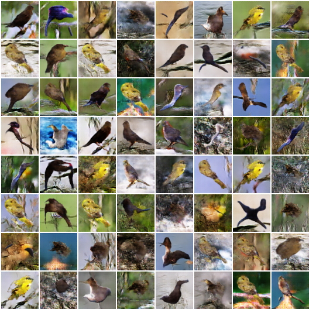
</div>

The layout is similar to MNIST-ONE. As we an see, the generator generated bird-shape masks, and thus make the final images sharper and cleaner.

3. **CIFAR-10**. CIFAR-10 can be automatically downloaded with pytorch dataloader. We use two timesteps for the generation. To train the model, run:
```bash
$ python train.py \
      --dataset cifar10 \
      --dataroot datasets/cifar10 \
      --ntimestep 2 \
      --imageSize 32 \
      --maxobjscale 1.2 \
      --niter 100 \
      --session 1
```
Here are some randomly sampled generation results:

<div style="color:#0000FF" align="center">
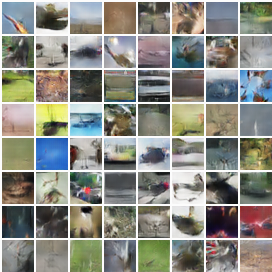 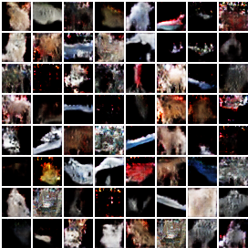  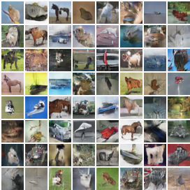
</div>

From left to right, they are generated background images, foreground images, foreground masks and final images. We can clearly find some horse-shape, bird-shape and boat-shape masks generated, and the finally generated images are more sharper.

4. **MNIST-TWO**. The images are 64x64 and contain two digits. We train the model using the following command:
```bash
$ python train.py \
      --dataset mnist-two \
      --dataroot datasets/mnist-two \
      --ntimestep 3 \
      --imageSize 64 \
      --maxobjscale 2 \
      --niter 50 \
      --session 1
```
<div style="color:#0000FF" align="center">
  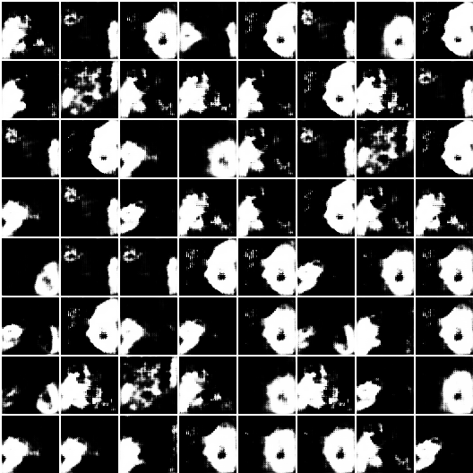 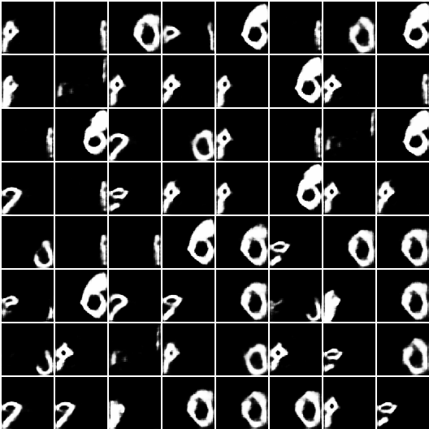
</div>
<div style="color:#0000FF" align="center">
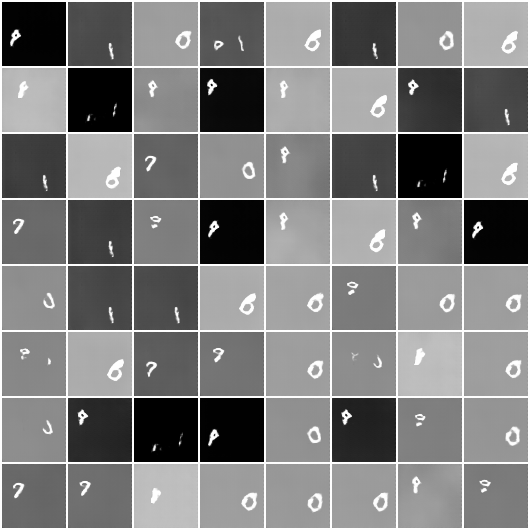 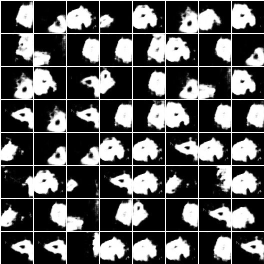 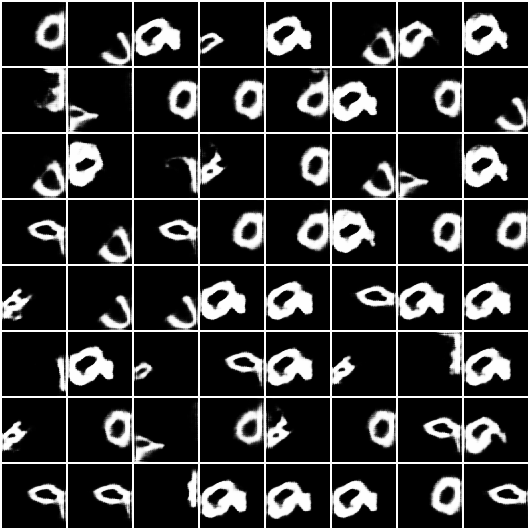 
</div>

The layout is the same to the one in our paper.

4. **LFW**. We train on 64x64 images, which can be downloaded from [here](https://filebox.ece.vt.edu/~jw2yang/datasets/cub200.tgz). Unzip it to the folder datasets/lfw. We train the model using the following command:
```bash
$ python train.py \
      --dataset lfw \
      --dataroot datasets/lfw \
      --ntimestep 2 \
      --imageSize 64 \
      --maxobjscale 1.3 \
      --niter 100 \
      --session 1
```

Below are the generation results:

<div style="color:#0000FF" align="center">
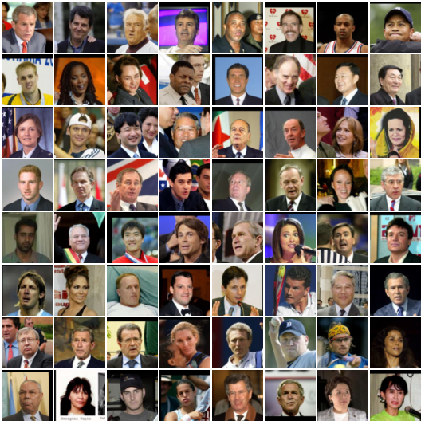 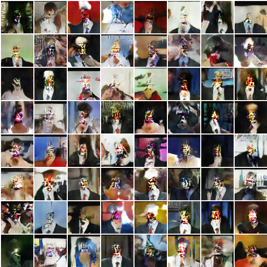 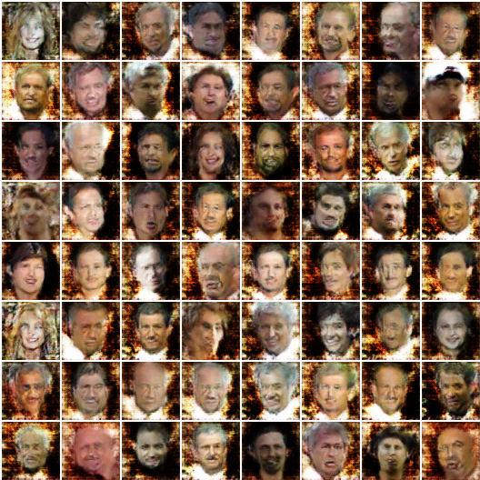 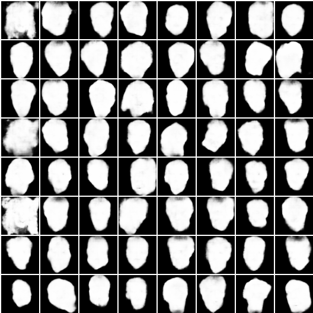 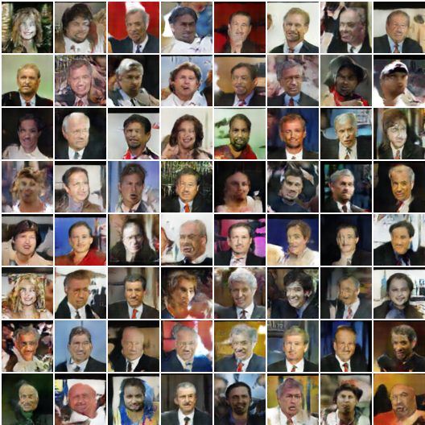
</div>

The left most 8x8 grid are the real images, followed by generated backgrounds, foregrounds, masks and final images.

### Test LR-GAN

After the training, the checkpoints will be saved to *models*. You can append two more options (*netG* and *evaluate*) to the command used for training model. Use cifar10 as the example, it will be:
```bash
$ python train.py \
      --dataset cifar10 \
      --dataroot datasets/cifar10 \
      --ntimestep 2 \
      --imageSize 32 \
      --maxobjscale 1.2 \
      --niter 100 \
      --session 1
      --netG models/cifar10_netG_s_1_epoch_100.pth
      --evaluate True
```
Then you can get the generation results for the session:1 and epoch:100 model in the folder *images*.
